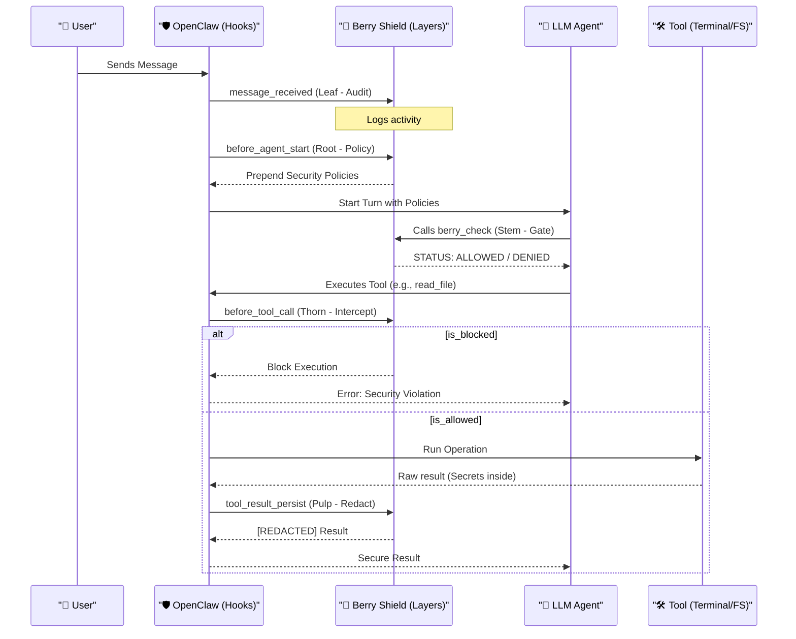
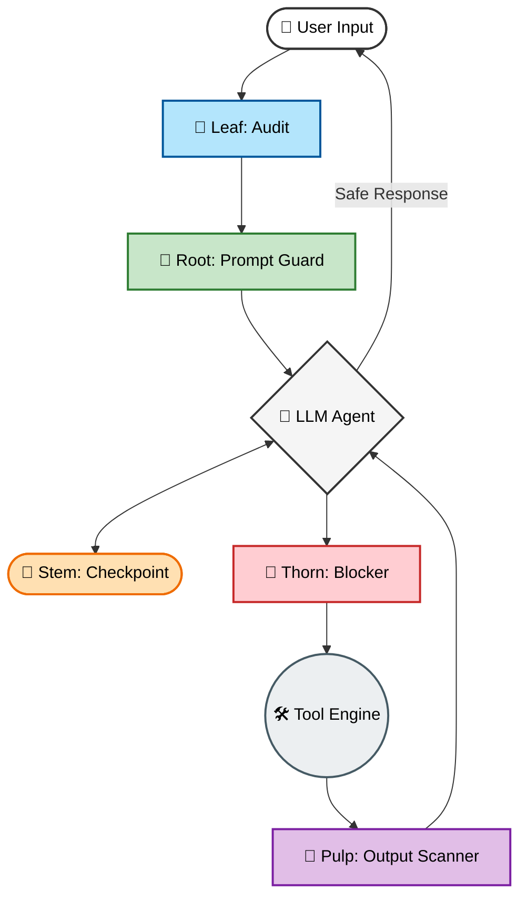

# 🍓 Berry Shield

> A modular security plugin for OpenClaw that helps manage data access and command execution.

[](package.json)
[](https://docs.openclaw.ai/tools/plugin)

## Overview

Berry Shield is a plugin for the OpenClaw ecosystem that provides several layers of observation and control over the Agent's interactions.

## 🏰 System Overview

Berry Shield is designed with multiple layers. The idea is that if an interaction isn't caught by one layer, it might be caught by another.

### Visual Lifecycle (Technical Sequence)

This diagram shows how Berry Shield hooks into the official OpenClaw lifecycle to protect your data.



### The Security Pipeline (Conceptual)

A simplified view of how the layers protect each phase of the process.



---

## 🛡️ The 5 Defense Layers

| Layer | Type | Technical Role |
|-------|------|----------------|
| 🌱 **Berry.Root** | **Policy Injection** | Establishes the security context and instructions for the Agent at the start of every turn. |
| 🌿 **Berry.Stem** | **Security Gate** | The primary tool-based checkpoint (`berry_check`) that the Agent must call before any risky operation. |
| 🌵 **Berry.Thorn** | **Active Blocker** | Implements runtime interception of destructive commands and sensitive file access. |
| 🍇 **Berry.Pulp** | **Data Censor** | Scans and redacts tool outputs and outgoing messages to prevent long-term data leaks. |
| 🍃 **Berry.Leaf** | **Audit Trail** | Provides non-intrusive logging of all incoming interactions for security auditing. |

---

## 🚀 Installation

```bash
# Clone the repository
git clone <repo-url>
cd berry-shield

# Install into OpenClaw
openclaw plugins install ./berry-shield

# Enable the plugin
openclaw plugins enable berry-shield
```

## ⚙️ Configuration

Configure Berry Shield in your `~/.openclaw/config.json`:

```json
{
  "plugins": {
    "berry-shield": {
      "mode": "enforce",
      "layers": {
        "root": true,
        "pulp": true,
        "thorn": true,
        "leaf": true,
        "stem": true
      }
    }
  }
}
```

---

## ⚙️ CLI Management

Berry Shield includes a CLI for managing security rules and monitoring status directly from the terminal.

### 📊 Dashboard & Monitoring
Quickly check the health and active layers of the plugin.

```bash
# General status dashboard
openclaw bshield status
```

### Self-Documentation
You can explore all available commands and flags directly from your terminal:

```bash
# General help
openclaw bshield --help
```

```bash
# Detailed help for specific commands
openclaw bshield add --help
```

```bash
# Detailed help for specific commands
openclaw bshield add secret --help
```

### 1. Adding Rules (The `add` Command)

You can add three types of security rules: `secret`, `file`, and `command`.

#### Advanced Redaction (Secrets)
Use the `--placeholder` flag to define exactly how a secret should appear in the logs/output.

```bash
# Add a rule for a custom Internal Token with a specific placeholder
openclaw bshield add secret \
  --name "InternalToken" \
  --pattern "INT_[a-z0-9]{32}" \
  --placeholder "[PROTECTED_INTERNAL_TOKEN]"
```

#### Targeted Blocking (Files & Commands)
Block access to specific files or execution of dangerous commands using patterns.

```bash
# Block specific production config
openclaw bshield add file --pattern "config/production\.json"
```

```bash
# Block all private key extensions
openclaw bshield add file --pattern "\.pem$"
```

```bash
# Block dangerous administrative commands
openclaw bshield add command --pattern "sudo"
```

### 2. Monitoring & Cleanup (`list` & `remove`)

Keep your security policy lean by listing and removing rules as needed.

```bash
# List all active rules (built-in and custom)
openclaw bshield list
```

```bash
# Remove a custom rule by its name
openclaw bshield remove InternalToken
```

### 3. Safety Verification (`test`)

Verify your patterns before deploying them to a live agent session.

```bash
# Test if a specific string triggers redaction
openclaw bshield test "My token is INT_abc1234567890abcdef1234567890ab"
```

---

## 🔍 Technical Details

### The `berry_check` Tool (The Gate)
The Agent is instructed to always call `berry_check` before executing commands or reading files. This provides an active defense that works even when standard hooks are unavailable.

```typescript
// Agent verification
berry_check({ operation: "exec", target: "rm -rf /" })
// Output: STATUS: DENIED | REASON: Destructive command detected
```

### Smart Cache
To reduce overhead, the rule set is only reloaded if the configuration file's modification time changes.

---

## ⚠️ Known Limitations & Blind Spots

### The "Timing Gap" (Pulp)
The `Berry.Pulp` layer (Output Scanner) operates on the `tool_result_persist` hook. 
*   **Limitation**: In some OpenClaw versions, the LLM may receive the raw tool output in its transient memory *before* the redaction is persisted to the session history.
*   **Mitigation**: **Berry.Stem** and **Berry.Thorn** are the primary defenses here. They prevent the LLM from ever seeing the data by blocking the operation *before* it returns results.

### Hook Availability (Thorn)
Runtime blocking through `before_tool_call` depends on the OpenClaw core wiring. 
*   **Reliability**: If this hook is not triggered by your version of OpenClaw, **Berry.Stem** (via the Tool API) remains the most robust fallback for preventing unauthorized actions.

---

## License
MIT
