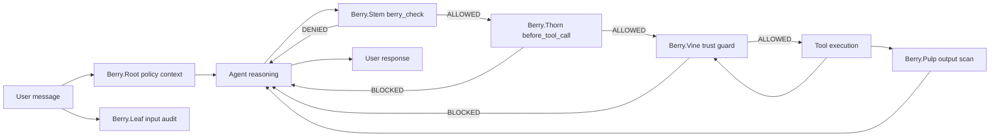

# 🍓 Berry Shield

Security plugin for OpenClaw that reduces data leakage risk and blocks unsafe operations in agent workflows.

## 🧐 Why this exists

Berry Shield was created from a practical problem: during routine setup checks, the agent could expose sensitive data directly in chat (API keys, tokens,
SSH material, and other secrets).

Typical examples included:
- reading config files that contained credentials (`openclaw.json`, `.env`, cloud credentials)
- returning sensitive command/file output without sanitization
- exposing private paths or secret-bearing content in normal troubleshooting flows

Design principles:
- Agents can read or execute sensitive operations by mistake.
- Prompt-only guardrails are not enough in real runtimes.
- Security controls must be visible, configurable, and testable from CLI.

The goal of `Berry Shield` is to reduce that risk in day-to-day usage by adding guardrails for access checks, runtime blocking, and output redaction.

---

## 🎯 What Berry Shield does

- Enforces a pre-flight security gate with `berry_check` before risky operations.
- Intercepts tool calls and blocks destructive or sensitive access patterns.
- Scans and redacts sensitive output before persistence and outbound delivery.
- Supports `enforce` and `audit` modes for rollout and validation.
- Provides CLI management for status, mode, policy, layers, rules, and report.

---

## ⚡ Quickstart

Install from npm package:

```bash
openclaw plugins install @f4bioo/berry-shield
```

**Note:** Berry Shield is plug-and-play after install. No extra setup is required for baseline protection.

See more:
- [Berry Shield Installation guide](docs/wiki/deploy/installation.md)

---

**Note:** If you want to customize mode, layers, or policy, use:

```bash
openclaw bshield --help
```

See more:
- [Berry Shield CLI reference](docs/wiki/operation/cli/README.md)

---

## 🧠 Mental model (single flow)

Berry Shield is designed with multiple layers. The idea is that if an interaction isn't caught by one layer, it might be caught by another.



## 🧬 Layers in plain language

| Layer | Purpose | Practical effect |
| :--- | :--- | :--- |
| **Leaf** 🍃 | **Input audit** | Logs sensitive signals in incoming content for observability. |
| **Root** 🌱 | **Prompt guard** | Injects security policy/reminders into agent context by profile strategy. |
| **Stem** 🪵 | **Security gate** | `berry_check` tool decides if intended operation is allowed or denied. |
| **Thorn** 🌵 | **Runtime blocker** | Intercepts tool calls and blocks risky command/file patterns in enforce mode. |
| **Vine** 🌿 | **External guard** | Marks external-content risk and can block sensitive actions under active risk. |
| **Pulp** 🍇 | **Output scanner** | Redacts sensitive data in tool results and outgoing messages in enforce mode. |

See more:
- [Berry Shield layers](docs/wiki/layers/README.md)

---

## ⚙️ Modes and profiles

### Modes (`mode`)

| Mode | Behavior |
| :--- | :--- |
| `enforce` | **Active Defense**: Blocks/Redacts when patterns match. |
| `audit` | **Silent Observation**: Logs what *would* have happened (`would_block`, `would_redact`). |

### Profiles (`policy.profile`)

| Profile | Injection behavior |
| :--- | :--- |
| `strict` | **Full policy** injection every turn. |
| `balanced` | **Adaptive**: Full on first turn, then `short`/`none` depending on risk/staleness. |
| `minimal` | **Silent**: Minimal injection by default; escalates only on critical triggers. |


See more:
- [Berry Shield modes and profiles](docs/wiki/decision/modes.md)

---

## 🚧 Technical Limitations & SDK Diary

Berry Shield's effectiveness is tied to the underlying OpenClaw SDK capabilities. We maintain a detailed diary that tracks known bugs and blind spots across OpenClaw versions.

### Key Points for v2026.2.14:
*   **Hook Reliability**: In our v2026.2.14 checkpoint, `before_tool_call` and `message_sending` were observed as functional, but hook behavior remains runtime/version-dependent.
*   **Soft Guardrails**: Prompt-based defenses (`Berry.Root`) are advisory and can be bypassed by clever user instructions.
*   **Timing Gaps**: Redaction happens during persistence, which might create a transient data exposure.

See more: 
-  [Security posture and known limits](docs/wiki/decision/posture.md)

---

## 📚 Docs map

- Wiki overview: [docs/wiki/README.md](docs/wiki/README.md)
- Install and deploy: [docs/wiki/deploy/installation.md](docs/wiki/deploy/installation.md)
- CLI commands: [docs/wiki/operation/cli/README.md](docs/wiki/operation/cli/README.md)
- Layer internals: [docs/wiki/layers/README.md](docs/wiki/layers/README.md)
- Mode/profile decisions: [docs/wiki/decision/modes.md](docs/wiki/decision/modes.md)
- Pattern strategy: [docs/wiki/decision/patterns.md](docs/wiki/decision/patterns.md)
- Tutorials: [docs/wiki/tutorials/README.md](docs/wiki/tutorials/README.md)

---

## ⚖️ License

Apache-2.0. See [LICENSE](LICENSE).

For contributor workflow and internal quality process, see [CONTRIBUTING.md](CONTRIBUTING.md).
