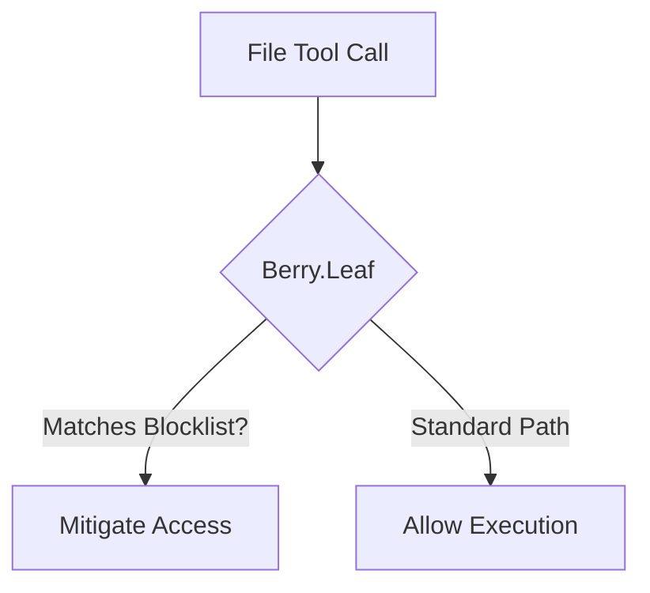

# Berry.Leaf (File Guard) - Architectural Explanation

## Overview
Berry.Leaf is the **file-system layer** of the Berry Shield stack. It is designed to provide a protective surface around sensitive project assets (e.g., `.env`, `.git`) by restricting tool-based read/write access to flagged paths.

## Logic Flow

## Why this approach?
- **Surface Mitigation**: Targets common targets for data exfiltration to help secure the project state.
- **Configurable Scope**: Can be adjusted to allow specific file operations while protecting core project metadata.

## Trade-offs
- **Tool Operation**: Legitimate developer tools (e.g. `git`, `npm`) might require temporary policy adjustments if they need access to protected paths.

## Related
- [API: registerBerryLeaf](../reference/layers/leaf/functions/registerBerryLeaf.md)
