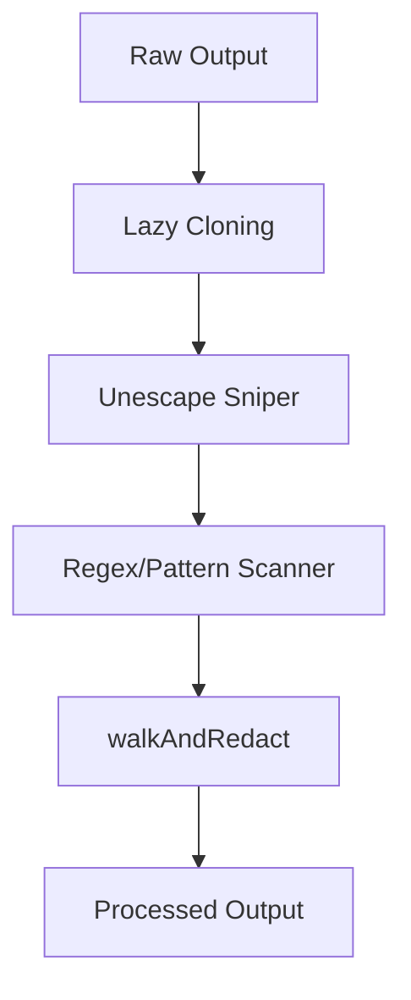

# Berry.Pulp (Output Redaction) - Architectural Explanation

## Overview
Berry.Pulp is the **redaction layer** of Berry Shield. It processes output data produced by the agent or tools, aiming to redact detected PII, secrets, and sensitive tokens.

## Logic Flow

## Why this approach?
- **Lazy Cloning**: Designed to minimize RAM usage by cloning objects only when a redaction is triggered.
- **Unescape Sniper**: Aims to mitigate bypasses that use escaped characters (e.g., in `curl` responses).
- **Recursion Safety**: `walkAndRedact` includes safeguards for handling deep objects and circular references.

## Trade-offs
- **Processing Overhead**: Scanning large payloads or complex objects can increase CPU usage during redaction.

## Related
- [[API: registerBerryPulp]](../reference/layers/pulp/functions/registerBerryPulp.md)
- [[Module: Redaction Utils]](../reference/utils/redaction/README.md)
