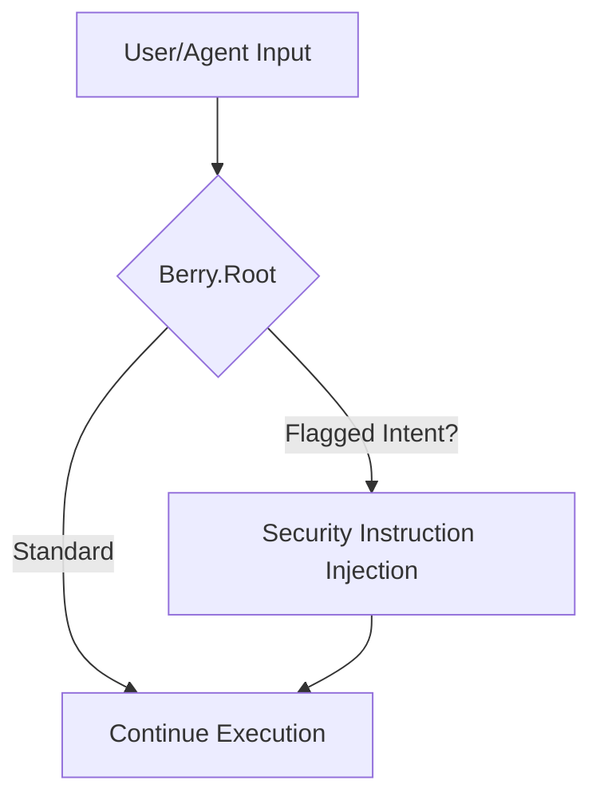

# Berry.Root (Prompt Guard) - Architectural Explanation

## Overview
Berry.Root is the **entry-point filter** of the Berry Shield security architecture. It is designed to act as an anchor, injecting security instructions before tool execution. Its primary role is to help mitigate malicious intent such as prompt injection and Jailbreak-like patterns.

## Logic Flow

## Why this approach?
- **Proactive Mitigation**: By sitting at the "root", it aims to modify the system prompt to warn the LLM about specific risks.
- **Contextual Intent**: It leverages the LLM's own analysis to identify complex adversarial patterns.

## Trade-offs
- **Token Overhead**: Injecting security instructions increases prompt size.
- **Initial Latacy**: Validating intent adds a processing step to the initial request.

## Related
- [API: registerBerryRoot](../reference/layers/root/functions/registerBerryRoot.md)
