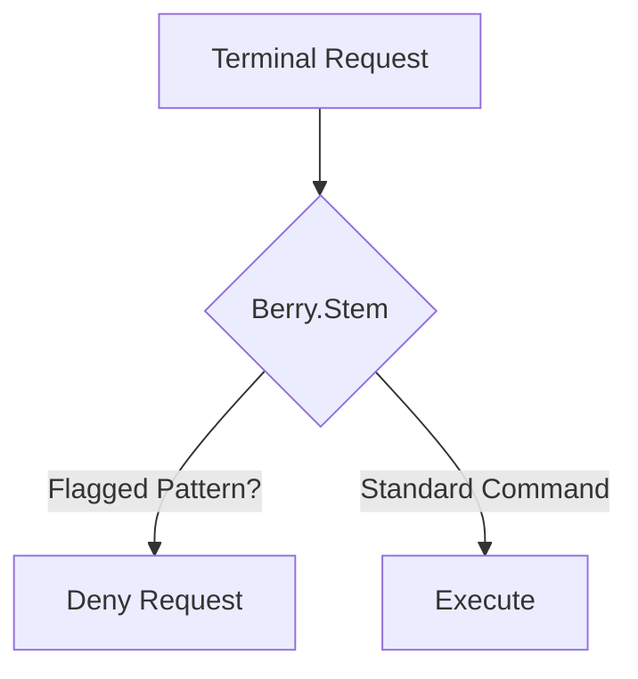

# Berry.Stem (Command Guard) - Architectural Explanation

## Overview
Berry.Stem is the **conductor for shell execution**. It wraps terminal-based tools to validate and monitor command strings, aiming to mitigate destructive patterns and dangerous execution flows.

## Logic Flow

## Why this approach?
- **Destructive Mitigation**: Specifically targets high-risk command patterns (e.g. unauthorized `rm` or `chmod` operations).
- **Execution Monitoring**: Analyzes the command string, including pipes and redirects, for potential risks.

## Trade-offs
- **Parsing Complexity**: Complex shell scripts with dynamic variables can be difficult to analyze with 100% precision.

## Related
- [API: registerBerryStem](../reference/layers/stem/functions/registerBerryStem.md)
