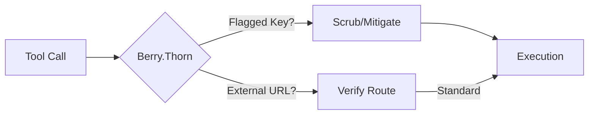

# Berry.Thorn (Edge Guard) - Architectural Explanation

## Overview
Berry.Thorn is designed as the **environment and network guard**. It aims to monitor system boundaries, specifically targeting flagged access to environment variables and monitoring network requests.

## Logic Flow

## Why this approach?
- **Edge Monitoring**: Focuses on the boundaries to help mitigate potential secret leakage from `process.env`.
- **Interception Logic**: Wraps tool executions to provide an additional security checkpoint.

## Trade-offs
- **Filter Precision**: Policy configurations may flag legitimate development traffic or environment variables if not properly scoped.

## Related
- [API: registerBerryThorn](../reference/layers/thorn/functions/registerBerryThorn.md)
