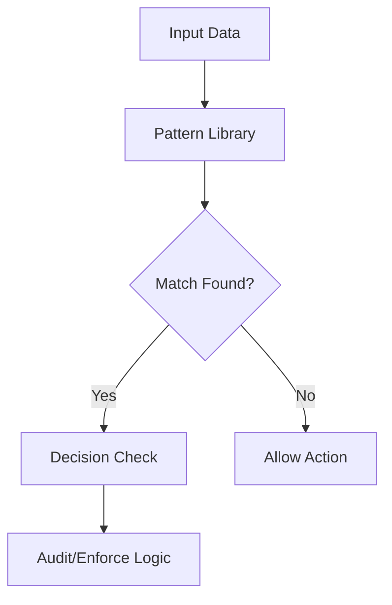

# Pattern Matching & Rules - Architectural Explanation

## Overview
The "intelligence" of Berry Shield's decision mechanism lies in its pattern matching engine. It leverages a combination of static regular expressions and rule sets to identify sensitive data (PII, secrets) and flagged behaviors (shell injection).

## Rule Categories

### 1. Built-in Patterns (The Foundation)
Core patterns designed to mitigate common risks:
- **Secret Detection**: Regex for keys, credentials, and private tokens.
- **Structural Guards**: Rules for project metadata (e.g. `.git`).
- **Command Filters**: Detection of flagged CLI patterns.

### 2. Custom Rules
Users can add patterns through the CLI:
- **Custom Regex**: Specific patterns tailored to a particular project.
- **Persistent Storage**: Rules are saved in the local database.

## Logic Flow

## Resilience and Limitations
The system aims to identify diverse risk patterns, relying on the regex library. For complex or obfuscated attacks, the system is designed to provide defensive layering rather than absolute detection.

---
- [[Back to Reference]](../reference/README.md)
