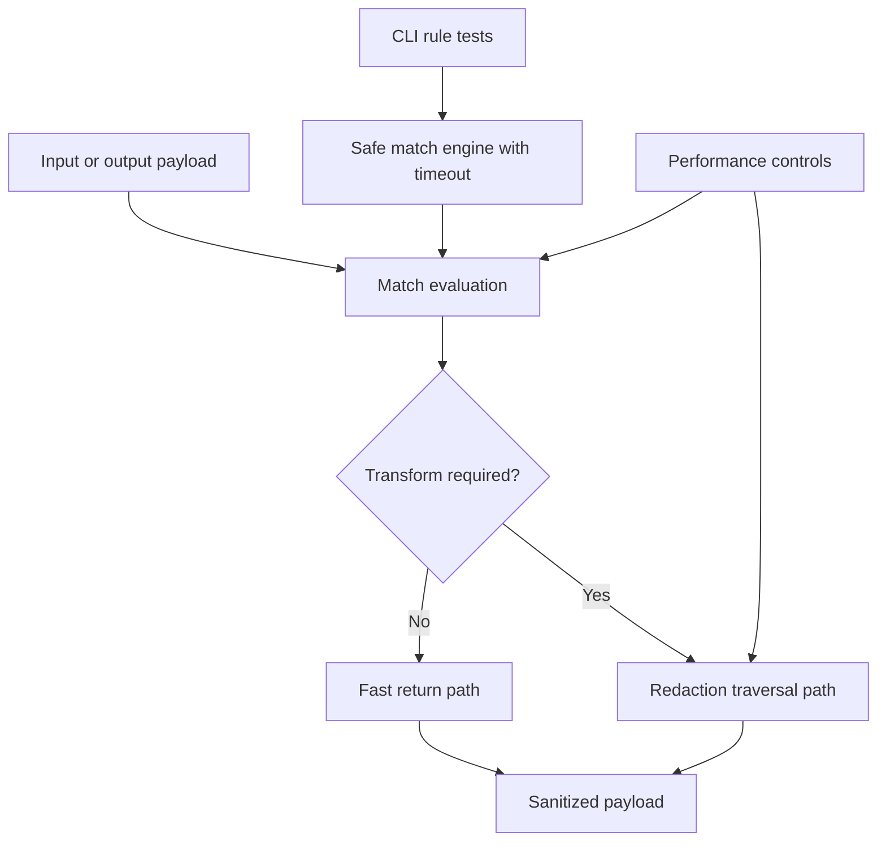

---
summary: "Engine index for Berry scanning, matching, and performance behavior"
read_when:
  - You need a technical map of content-processing internals
  - You are debugging detection or redaction behavior
  - You are evaluating runtime cost and safety tradeoffs
title: "Engine Reference"
---

# `Engine reference`

This page is the entry point for Berry engine internals.
It covers how matching, redaction, and performance characteristics fit together.

## Engine pages

- [redaction](redaction.md): transformation behavior for string/object payloads
- [match engine](match-engine.md): safe CLI regex matching behavior
- [performance](performance.md): runtime cost model and optimization tradeoffs

## Engine interaction (single view)

## Responsibility boundaries

- Redaction page explains how content is transformed.
- Match engine page explains safe CLI regex execution.
- Performance page explains cost drivers, optimization levers, and tradeoffs.

## Related pages
- [wiki index](../README.md)
- [layers index](../layers/README.md)
- [decision patterns](../decision/patterns.md)

---

## Navigation
- [Back to Wiki Index](../README.md)
- [Back to Repository README](../../../README.md)

