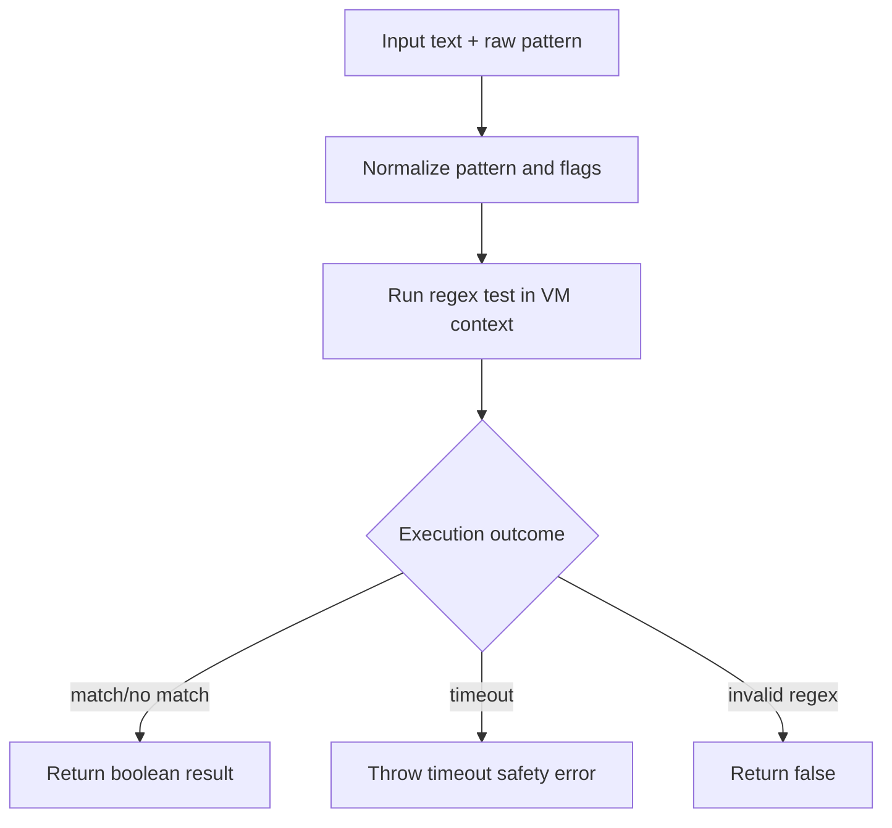

---
summary: "Engine reference for safe regex matching used by Berry CLI rule validation paths"
read_when:
  - You are debugging CLI pattern test behavior
  - You are validating regex safety in rule preview flows
  - You need to understand timeout behavior in pattern matching
title: "match engine"
---

# `Match engine`

Berry match engine is the safe regex matching utility used by CLI validation paths.
Its goal is to reduce catastrophic-regex risk during interactive or deterministic pattern checks.

## Engine responsibilities

- Compile and evaluate regex patterns for CLI matching operations.
- Apply bounded execution timeout for regex test runs.
- Support case-insensitive prefix normalization.
- Fail safely on invalid patterns.

## Runtime flow

## Processing details

### Pattern normalization

- default flags are case-insensitive global matching
- inline prefix `(?i)` is normalized into case-insensitive behavior

### Safe execution boundary

- matching runs in a VM execution context
- timeout is bounded (default 100ms, configurable)
- timeout triggers explicit safety error describing potential ReDoS condition

### Failure behavior

- invalid regex syntax returns false
- timeout raises explicit error to surface risk

## Where this engine is used

- CLI test command pattern checks
- CLI wizard preview checks for rule creation paths

This utility is a CLI-side matcher.
Runtime layer interception/redaction uses separate utilities optimized for layer execution paths.

## Operational value

This engine provides:
- safer CLI pattern experimentation
- predictable behavior for bad regex input
- early signal for potentially catastrophic patterns

## Limits and caveats

- Timeout-based control reduces risk but does not replace regex quality review.
- Behavior is scoped to CLI matching paths, not all runtime matching paths.
- Very large inputs still increase work, even with timeout bounds.

## Validation checklist

1. Confirm normal pattern returns expected boolean.
2. Confirm invalid regex returns false without process crash.
3. Confirm catastrophic pattern triggers timeout safety error.
4. Confirm wizard/test commands produce consistent matching decisions.

## Related pages
- [engine index](README.md)
- [redaction](redaction.md)
- [performance](performance.md)
- [CLI test command](../operation/cli/test.md)

---

## Navigation
- [Back to Engine Index](README.md)
- [Back to Wiki Index](../README.md)

