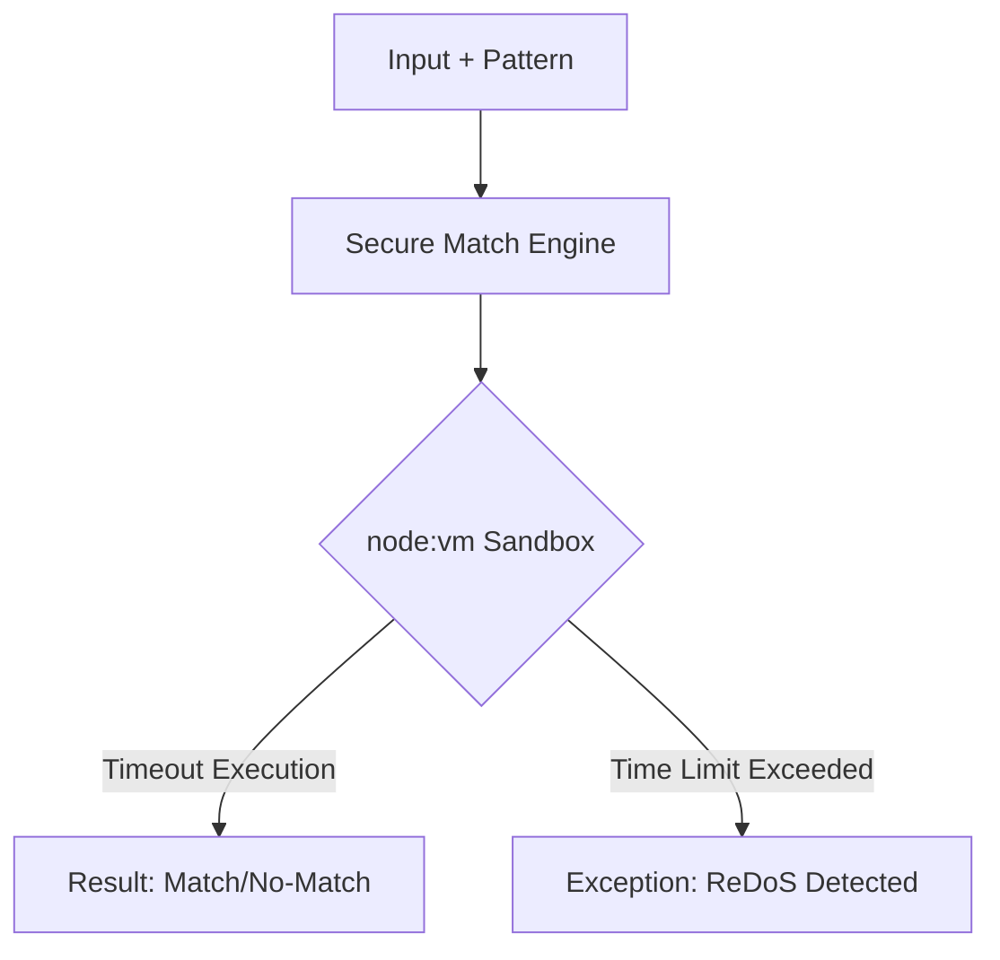

# Secure Match Engine - Architectural Explanation

## Overview
The Berry Shield **Match Engine** provides a secure execution environment for regular expression matching across the CLI and core layers. It aims to mitigate the risk of **Regular Expression Denial of Service (ReDoS)** by isolating regex execution from the main process.

## Logic Flow

## Why this approach?
- **Isolation**: By using `node:vm`, the engine runs regex patterns in a separate execution context.
- **Resource Limiting**: A strict timeout of 100ms is applied to regex execution to prevent catastrophic backtracking from freezing the process.
- **Unified Logic**: Both the `add` wizard (for previews) and the **test command** share the same secure utility (`matchAgainstPattern`), ensuring behavioral consistency.

## Trade-offs
- **Performance**: The overhead of creating a VM context is higher than direct regex execution, though minimal for individual interactive operations.
- **Environment**: Relies on Node.js internal modules, which are available in all supported Berry Shield environments.

## Related
- [Interactive Wizards](../operation/wizards.md)
- [CLI Reference](../operation/cli.md)
