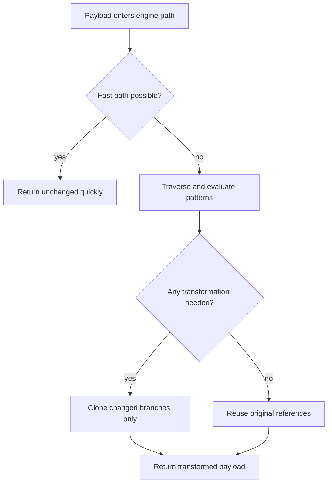

---
summary: "Engine reference for performance profile, optimization strategy, and runtime tradeoffs"
read_when:
  - You are evaluating runtime cost of scanning and redaction
  - You are tuning patterns for better latency and memory behavior
  - You are validating behavior on constrained environments
title: "performance"
---

# `Performance and optimization`

Berry Shield is designed for practical security execution under real runtime constraints.
The performance strategy prioritizes predictable behavior, bounded memory growth on common paths, and acceptable latency during content scanning.

## Overview

Engine performance is shaped by:
- payload size and nesting depth
- pattern set breadth and regex complexity
- number of scan/interception hook invocations
- match frequency (more matches generally means more replacement work)

The current implementation favors change-only transformation and fast no-match returns where possible.

## Optimization strategy

### Lazy cloning

Deep-cloning every payload on every pass is expensive.
Berry runtime traversal follows a lazy approach:
- keep original references when no changes are required
- clone object branches only after actual transformation is needed

This reduces memory churn and lowers garbage-collection pressure on no-change paths.

### Circular-reference guard

Recursive traversal uses seen-set protection for object graphs.
This avoids repeated traversal loops and helps keep runtime stable for cyclic payloads.

### Fast-path behavior

Primitive/no-scan paths return quickly.
On string paths, original content can be preserved when no redaction match is found.

### Pattern caching and reuse

Effective pattern sets are prepared and reused by category.
This avoids rebuilding full pattern arrays on every operation path.

## Runtime flow (cost perspective)

## LLM context efficiency impact

Redaction and cleanup can reduce repeated sensitive-noise in model-visible artifacts and persisted transcripts.
Operationally, this can improve context quality by:
- reducing repetitive secret/token fragments
- minimizing irrelevant high-entropy payload noise
- preserving clearer task-relevant content after sanitation

## Constrained environment profile

Berry aims to stay usable on constrained devices and low-overhead deployments by combining:
- lazy clone semantics
- circular guard traversal
- practical pattern tuning expectations

Outcome depends on workload shape.
Large deeply nested payloads with broad aggressive patterns still increase cost and should be tuned intentionally.

## Practical tuning guidance

1. Prefer targeted custom patterns over broad catch-all expressions.
2. Validate new patterns with CLI test flows before production use.
3. Use audit cycles to measure match volume and false-positive pressure.
4. Keep tool outputs scoped where possible to reduce unnecessary scan volume.

## Limits and caveats

- Performance behavior remains workload-dependent and cannot be constant across all payload classes.
- Regex quality directly affects both latency and detection reliability.
- CLI safe-match timeout behavior applies to CLI matcher paths, not every runtime layer path.

## Validation checklist

1. Confirm no-match payloads preserve original references.
2. Confirm changed payloads clone only modified branches.
3. Confirm cyclic payloads are processed without recursion failure.
4. Confirm catastrophic regex patterns are bounded in CLI safe matcher paths.

## Related pages

- [engine index](README.md)
- [redaction](redaction.md)
- [match engine](match-engine.md)
- [decision posture](../decision/posture.md)

