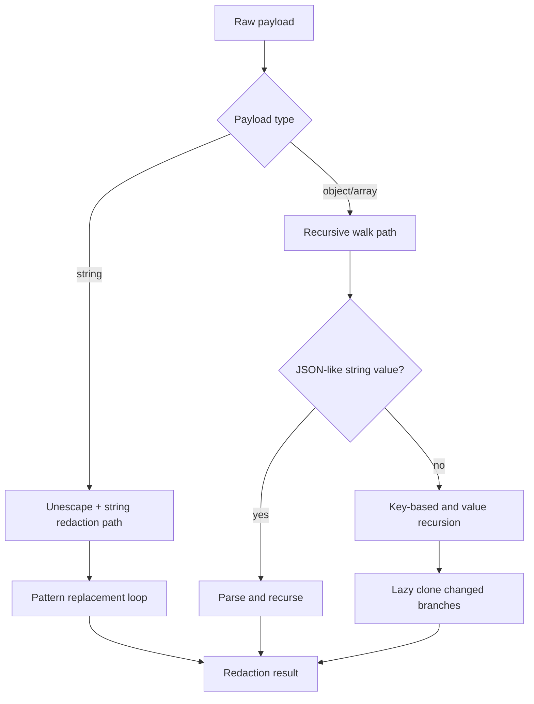

---
summary: "Engine reference for redaction behavior, pattern provenance, and transformation flow"
read_when:
  - You need to understand how sensitive content is detected and transformed
  - You are validating output sanitation behavior in runtime layers
  - You are reviewing pattern provenance and redaction behavior
title: "redaction"
---

# `Redaction engine`

The redaction engine is the central transformation layer for sensitive-content handling in Berry Shield.
It is used by runtime layers that need to detect, classify, and sanitize secrets and PII in content payloads.

## Overview

In runtime terms, the engine provides:
- text-level redaction for string payloads
- recursive traversal for arrays and nested objects
- key-based masking for sensitive field names
- match metadata for audit/reporting paths

This behavior feeds both observability (audit paths) and mitigation (enforce paths), depending on layer mode decisions.

## Detection intelligence and pattern provenance

The detection model combines multiple sources:

- Static regex families for common credential and PII classes.
- Community-derived secret patterns from Gitleaks source configuration.
- Key-based masking for sensitive JSON/object field names (for example password/token-style keys).

### Gitleaks provenance in Berry

Berry includes a generated pattern source derived from Gitleaks configuration and tracked in source with explicit provenance metadata.
This keeps pattern evolution practical while preserving local runtime control over placeholder behavior and layer-specific decisions.

Important nuance:
- Gitleaks-derived rules contribute to detection coverage.
- Final behavior (observe, redact, deny, allow) still depends on Berry layer and mode logic.

## Unescape handling

Escaped payloads can hide sensitive tokens in operational logs and tool responses.
Before regex evaluation on string paths, engine logic applies a practical unescape pass for common escaped forms.

Why this matters:
- improves detection on JSON-escaped and partially encoded outputs
- reduces false negatives caused by escaped delimiters or unicode escape sequences

## Runtime flow

## Core behavior details

### String redaction path

- normalizes escaped content candidate
- evaluates active patterns in sequence
- replaces matched segments with pattern placeholders
- preserves original text when no match exists

### Recursive walk path

- traverses arrays and objects deeply
- guards against circular references with seen-set tracking
- can parse JSON-like strings and recurse into parsed values
- returns redaction stats (count and matched type names)

### Key-based masking path

For object keys recognized as sensitive:
- primitive values may be replaced with key-derived mask marker
- this complements regex detection where value format alone may be ambiguous

## Where the redaction engine is used

- [Pulp layer](../layers/pulp.md): output-side sanitation and redaction outcomes
- [Leaf layer](../layers/leaf.md): inbound sensitivity signaling for audit visibility
- [Thorn layer](../layers/thorn.md): match-only helper path for interception checks

## Limits and caveats

- Regex coverage is heuristic and pattern quality-dependent.
- JSON-string parsing applies only when payload is parseable as JSON shape.
- Unescape logic uses practical common forms, not universal decoding for all encodings.
- Large payload size and pattern count directly affect processing cost.

## Validation checklist

1. Verify known secret strings map to expected placeholders.
2. Verify nested-object traversal redacts only affected branches.
3. Verify circular structures are handled without traversal failures.
4. Verify escaped-token samples are detected after normalization.

## Related pages

- [engine index](README.md)
- [match engine](match-engine.md)
- [performance](performance.md)
- [decision patterns](../decision/patterns.md)

---

## Navigation

- [Back to Engine Index](README.md)
- [Back to Wiki Index](../README.md)
