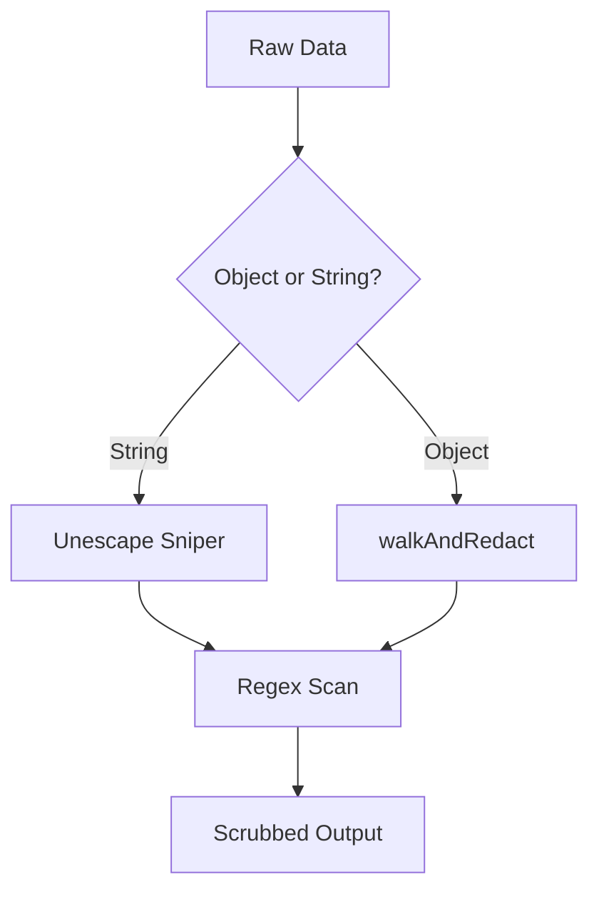

# Redaction Engine - Technical Explanation

## Overview
The Redaction Engine is the primary defensive component of the [Pulp Layer](../anatomy/pulp.md). Its goal is to identify and scrub sensitive tokens from tool outputs and agent responses.

## Detection Intelligence
To maintain high mitigation accuracy, the engine uses a multi-tiered approach:

- **Static Regex**: Internal patterns for common identifiers.
- **Community Patterns (Gitleaks)**: Berry Shield consumes a curated subset of regular expressions from the **Gitleaks** project. This integration leverages battle-tested patterns for identifying cloud credentials and API keys without reinventing detection logic.
- **Key-Value Scanning**: For JSON objects, the engine iterates through keys to identify flagged metadata (e.g., `password`, `token`, `secret`).

## Unescape Sniper
Malicious actors or inadvertently escaped tool outputs (like `curl` or `db` logs) can hide secrets in encoded strings.
- **Function**: The engine attempts to unescape common sequence patterns before running regex scans, aiming to catch secrets that would otherwise bypass standard string matching.

## Logic Flow

---
- [[API: Redaction Utils]](../reference/utils/redaction/README.md)
