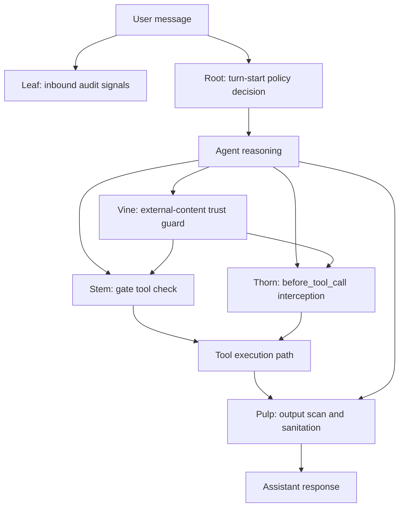

---
summary: "Layer index for Berry Shield runtime architecture and cross-layer interaction map"
read_when:
  - You need a quick map of all six layers
  - You are tracing a user-input to output-security path
  - You are onboarding to Berry Shield internals
title: "Layers Reference"
---

# `Layers reference`

This page is the entry point for Berry Shield layer architecture.
It explains what each layer owns and how layers interact during runtime.

## Layer map

- [root](root.md): policy injection strategy at turn start
- [leaf](leaf.md): incoming-message audit and sensitive-signal logging
- [stem](stem.md): gate tool for pre-operation allow/deny decisions
- [thorn](thorn.md): hook-level pre-tool-call interception and blocking
- [vine](vine.md): external-content trust guard for prompt-injection hardening
- [pulp](pulp.md): output scanning, sanitation, and policy-block hygiene

## End-to-end interaction (single view)

## Responsibility boundaries

- Root controls policy presence in context, not hard operation execution.
- Leaf provides observability on inbound content, not inbound blocking.
- Stem evaluates operation intent through a gate tool path.
- Thorn intercepts tool calls on hook path when host runtime supports invocation.
- Vine tracks external-content risk signals and adds trust-aware guardrails.
- Pulp sanitizes output paths and strips leaked policy snippets.

## How to read this section

Use this index in two passes:
1. Read each layer page for exact runtime behavior and limits.
2. Return to this map to confirm where a failure or mismatch belongs.

## Related pages

- [wiki index](../README.md)
- [decision modes](../decision/modes.md)
- [decision patterns](../decision/patterns.md)
- [decision posture](../decision/posture.md)

---

## Navigation

- [Back to Wiki Index](../README.md)
- [Back to Repository README](../../../README.md)
