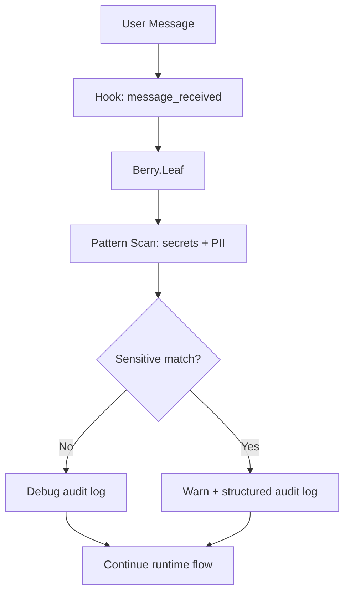

---
summary: "Layer reference for Berry.Leaf (incoming message audit and sensitive-signal logging)"
read_when:
  - You need to understand what Leaf actually does in runtime
  - You are validating input-observability behavior
  - You are debugging why incoming messages are logged but not blocked
title: "leaf"
---

# `Berry.Leaf`

Berry.Leaf is the **incoming-message audit layer**.

Despite the name Leaf, this layer is not a file blocker.  
Its runtime role is: observe inbound user text, detect sensitive signals, and emit audit logs.

## What Leaf does

- Hooks into message_received.
- Scans inbound message text with redaction patterns (secrets + PII).
- Produces audit signals (containsSecrets, containsPII, sensitiveTypes).
- Writes structured debug logs and warning logs for sensitive hits.

In code terms, this is an observation pipeline, not an enforcement pipeline.

## What Leaf does not do

- It does not block incoming user messages.
- It does not rewrite incoming user content before model processing.
- It does not decide tool allow/deny.
- It does not redact outbound messages.

Reason: `message_received` is used as an observe-only path in this plugin design.

## Runtime flow

## Data extracted by Leaf

For each non-empty inbound message, Leaf derives:

- timestamp
- session identifier (when available in context)
- source/sender fields
- message length
- secret/PII presence flags
- sensitive type list matched by patterns

This gives operators evidence for risk monitoring without storing transformed user text as policy output.

## How Leaf interacts with other layers

Leaf is one signal producer in a layered system.

### With Root
- Root controls policy injection into agent context.
- Leaf does not influence Root decisions directly.
- Both can operate in the same turn, but on different concerns (guidance vs observability).

### With Stem
- Stem enforces security gate outcomes (`berry_check`) on operations.
- Leaf can reveal that risky intent appeared in user input before operation attempts.
- Stem is enforcement; Leaf is telemetry.

### With Thorn
- Thorn intercepts runtime tool calls (`before_tool_call`) when available.
- Leaf can show early input indicators that later map to Thorn block events.

### With Pulp
- Pulp handles output-side redaction/hygiene.
- Leaf handles input-side detection/auditing.
- Together, they provide inbound and outbound visibility.

## Operational value

Leaf is useful for:

- measuring sensitive-input frequency
- building audit trails for compliance/security review
- correlating "user asked for risky action" with later deny/redact events
- tuning detection rules with real conversational signals

## Limits and caveats

- Leaf is only as strong as pattern coverage and matching quality.
- If context fields are missing from runtime, session-level correlation can degrade.
- Leaf should not be interpreted as a user-input firewall.
- Use Leaf together with Stem/Thorn/Pulp for active mitigation posture.

## Validation checklist

Use this quick check during runtime validation:

1. Send benign message and confirm debug audit entry appears.
2. Send message containing test secret/PII marker and confirm warning audit entry appears.
3. Confirm message still proceeds (Leaf observation behavior).
4. Trigger a risky operation and correlate Leaf signal with Stem/Thorn outcomes.

## See layers

- [root](root.md)
- [stem](stem.md)
- [thorn](thorn.md)
- [pulp](pulp.md)

## Related pages
- [layers index](README.md)
- [decision modes](../decision/modes.md)
- [decision patterns](../decision/patterns.md)

---

## Navigation
- [Back to Layers Index](README.md)
- [Back to Wiki Index](../README.md)
