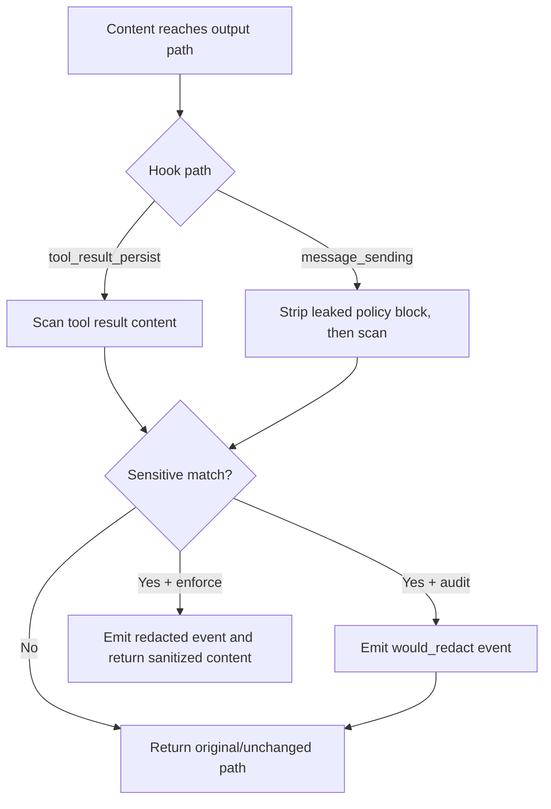

---
summary: "Layer reference for Berry.Pulp (output scanning, redaction paths, and policy-block hygiene)"
read_when:
  - You need to understand output-side sanitation behavior
  - You are validating audit vs enforce output outcomes
  - You are debugging redaction events or leaked policy snippets
title: "pulp"
---

# `Berry.Pulp`

Berry.Pulp is the **output scanning and sanitation layer**.

It inspects tool results and outgoing messages, applies sensitive-pattern scanning, and handles mode-specific redaction behavior.

## What Pulp does

- Hooks into tool_result_persist for tool output persistence path.
- Hooks into message_sending for outgoing assistant message path.
- Runs pattern-based scan over content payloads.
- Emits structured redaction events in both audit and enforce paths.
- In enforce mode, returns sanitized content when redaction is required.
- Applies policy-block hygiene by stripping leaked policy snippets from outgoing messages.

## What Pulp does not do

- It does not block tool execution requests.
- It does not classify command/file operation risk for allow/deny.
- It does not guarantee what the model already consumed before persistence-time hook execution.
- It does not replace operation gate logic from Stem or interception logic from Thorn.

## Runtime flow

## Decision inputs

Pulp consumes:
- content payload from hook event
- effective redaction patterns (built-in + custom)
- runtime mode (audit or enforce)
- hook path context (tool_result_persist or message_sending)

## Decision behavior (high level)

### Tool result persist path
- scans tool result message content
- if sensitive match:
  - audit: emits observation event and keeps original content
  - enforce: emits redaction event and returns sanitized message

### Message sending path
- first strips leaked policy block markers from outgoing content
- then scans resulting content for sensitive match
- if sensitive match:
  - audit: emits observation event and generally does not rewrite for redaction
  - enforce: emits redaction event and returns sanitized content
- if only policy block leak is found, returns content with policy block removed

## Policy-block hygiene behavior

Pulp includes a dedicated outgoing hygiene step:
- detects leaked policy wrapper snippets
- removes them from outgoing message content
- logs that policy leakage was stripped

This hygiene step is independent from secret/PII redaction outcomes.

## How Pulp interacts with other layers

### With Stem
- Stem decides whether risky operations should proceed.
- Pulp sanitizes output content after content exists.

### With Thorn
- Thorn can stop risky calls before execution.
- Pulp handles content-side sanitation for outputs that still reach output hooks.

### With Root
- Root injects security guidance text into context.
- Pulp can remove leaked policy snippets before user delivery in outgoing messages.

### With Leaf
- Leaf provides inbound audit visibility.
- Pulp provides outbound sanitation visibility.

## Operational value

Pulp is useful for:
- reducing secret/PII exposure in stored and outbound content paths
- providing structured output-side audit evidence
- containing leaked policy-block echoes in user-visible responses

## Limits and caveats

- tool_result_persist is persistence-time; model output in the same turn may have already seen raw content.
- behavior depends on host runtime hook availability/invocation.
- pattern quality and coverage control redaction quality.
- should be operated with Stem/Thorn for stronger defense-in-depth.

## Validation checklist

1. Send benign output content and confirm unchanged behavior.
2. Produce output containing sensitive marker and confirm mode-specific outcome:
   - audit: observation event
   - enforce: sanitized output path
3. Force leaked policy wrapper in outgoing content and confirm stripping behavior.
4. Confirm report includes expected would_redact or redacted event counts.

## See layers

- [root](root.md)
- [stem](stem.md)
- [thorn](thorn.md)
- [leaf](leaf.md)

## Related pages

- [layers index](README.md)
- [decision modes](../decision/modes.md)
- [decision patterns](../decision/patterns.md)
- [decision posture](../decision/posture.md)
- [engine redaction](../engine/redaction.md)

---

## Navigation

- [Back to Layers Index](README.md)
- [Back to Wiki Index](../README.md)
