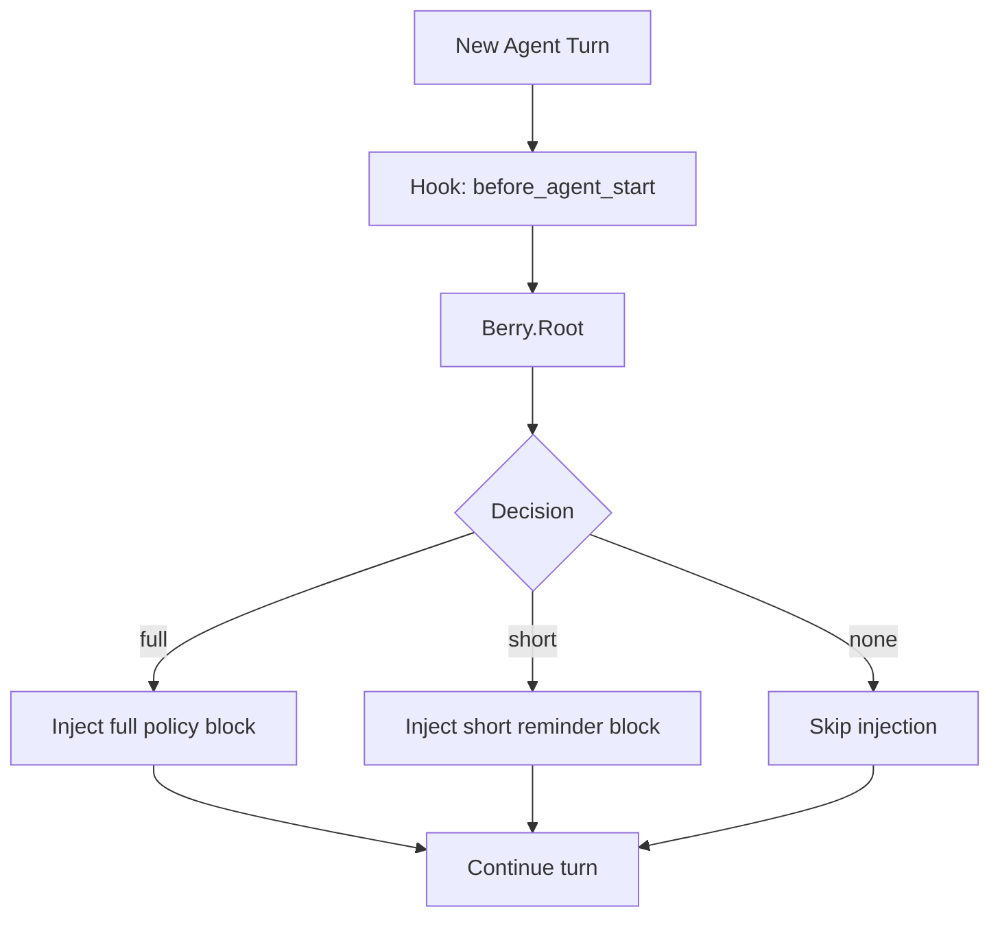

---
summary: "Layer reference for Berry.Root (policy injection strategy at agent turn start)"
read_when:
  - You need to understand how policy text is injected per turn
  - You are validating profile/adaptive behavior in real sessions
  - You are debugging repeated policy text or missing reminders
title: "root"
---

# `Berry.Root`

Berry.Root is the **policy-injection layer** that runs at agent turn start.

Its role is to decide whether the turn receives:
- full policy block
- short reminder block
- no injection

This decision is computed from session state + policy config (profile/adaptive/retention).

## What Root does

- Hooks into before_agent_start.
- Computes per-turn decision (full, short, none) using shared policy state.
- Injects policy text through prependContext when decision is full or short.
- Uses session identity when available; falls back to global_session and forces full for safety.
- Clears per-session state on session_end.

## What Root does not do

- It does not hard-block tool execution by itself.
- It does not redact content.
- It does not classify file/command risk directly.
- It does not replace Stem/Thorn/Pulp enforcement paths.

Root is guidance and control-plane orchestration for prompt policy presence.

## Runtime flow

## Decision inputs

Root consumes:
- session key (sessionId/sessionKey when available)
- provider/message provider identity
- profile (`strict`, `balanced`, `minimal`)
- adaptive settings (stale window, escalation turns, heartbeat, global escalation)
- retention limits for state tracking

## Decision behavior (high level)

- strict: full policy every turn.
- balanced: first turn full; later turns typically none; short reminder on stale/heartbeat turns.
- minimal: first turn none; mostly none; short reminder only on heartbeat.
- forced-full windows can be triggered by adaptive escalation signals.
- provider changes can trigger full reinjection.
- missing session identity forces full policy for safety.

## How Root interacts with other layers

### With Stem
- Root instructs model behavior (call berry_check first).
- Stem is the actual gate tool that returns allow/deny decisions.
- Root improves compliance probability; Stem provides enforceable gate responses.

### With Thorn
- Root guidance reduces risky tool attempts.
- Thorn can still block tool calls at hook level where available.

### With Pulp
- Root influences what the agent attempts to output.
- Pulp sanitizes output paths when sensitive material appears.

### With Leaf
- Root controls policy visibility cadence.
- Leaf provides inbound observability; it does not drive Root decisions directly.

## Operational value

Root is useful for:
- reducing repeated policy spam while preserving safety reminders
- adapting policy visibility by session behavior
- keeping first-turn security context explicit when required
- supporting low-noise profiles without disabling enforcement layers

## Limits and caveats

- Root is instruction-level control, not hard execution enforcement.
- If runtime context identity is missing, global safety fallback can increase policy verbosity.
- Excessive full injections increase token cost.
- Too little reinjection can reduce model adherence in long sessions.

## Validation checklist

1. Start a new session and confirm expected first-turn behavior for chosen profile.
2. Send follow-up turns and confirm full/short/none cadence matches profile + adaptive config.
3. Trigger denied events and verify forced-full window behavior on subsequent turns.
4. End session and confirm state is cleared for the previous session id.

## See layers

- [leaf](leaf.md)
- [stem](stem.md)
- [thorn](thorn.md)
- [pulp](pulp.md)

## Related pages
- [layers index](README.md)
- [decision modes](../decision/modes.md)
- [decision posture](../decision/posture.md)
- [CLI profile](../operation/cli/profile.md)
- [CLI policy](../operation/cli/policy.md)

---

## Navigation
- [Back to Layers Index](README.md)
- [Back to Wiki Index](../README.md)
