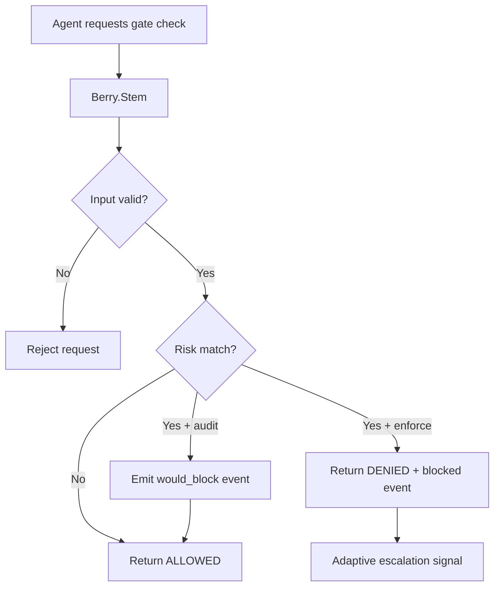

---
summary: "Layer reference for Berry.Stem (security gate tool for exec/read/write decisions)"
read_when:
  - You need to understand how pre-operation deny/allow decisions are made
  - You are validating audit vs enforce behavior on operation checks
  - You are debugging why an operation was denied or allowed
title: "stem"
---

# `Berry.Stem`

Berry.Stem is the **security gate tool layer**.

It registers the gate tool used by the agent before risky operations.
The tool evaluates operation intent (exec, read, write) against destructive-command and sensitive-file patterns.

## What Stem does

- Registers the gate tool for operation checks.
- Validates tool input schema (operation + target + optional session key).
- Evaluates:
  - destructive command intent in exec requests
  - sensitive file references in exec requests
  - sensitive file access in read/write requests
- Emits structured audit events in both audit and enforce paths.
- Returns allow/deny response payloads to the agent.
- Returns a degraded human-confirm-required warning when Vine risk is active but native confirmation binding is unavailable.
- Triggers adaptive escalation signaling on enforce denies.

## What Stem does not do

- It does not directly execute shell or file operations.
- It does not redact output text.
- It does not depend on before_tool_call hook availability.
- It does not guarantee model compliance by itself; it provides gate decisions the model should follow.

## Runtime flow

## Decision inputs

Stem consumes:
- operation type (exec, read, write)
- target string (command or file path)
- optional session key for adaptive escalation binding
- effective sensitive/destructive pattern sets (built-in + custom)
- runtime mode (audit or enforce)

## Decision behavior (high level)

### Exec operation
- checks destructive command patterns
- checks sensitive file references inside command target
- audit: records observation and returns allow path
- enforce: records blocked decision and returns denied response

### Read or write operation
- checks sensitive file patterns against target path
- audit: records observation and returns allow path
- enforce: records blocked decision and returns denied response

### Adaptive escalation signal
- on enforce deny, signals policy runtime state
- prefers session-scoped escalation when session key exists
- can use configured global escalation fallback when session key is missing

## How Stem interacts with other layers

### With Root
- Root injects policy guidance that instructs the agent to call the gate tool first.
- Stem returns concrete allow/deny decisions.
- Root improves calling discipline; Stem provides operational gate outcomes.

### With Thorn
- Thorn can block direct tool calls via hook path where available.
- Stem remains valuable as a tool-level gate even when hook coverage varies.

### With Pulp
- Stem controls operation permission before execution.
- Pulp controls output sanitation after content exists.

### With Leaf
- Leaf provides inbound sensitive-input observability.
- Stem provides operation-time gate decisions.

## Operational value

Stem is useful for:
- pre-operation control independent of hook wiring variability
- deterministic deny messages for risky operations
- unified gate behavior for exec/read/write checks
- adaptive policy escalation signals tied to denied actions

## Limits and caveats

- Gate effectiveness depends on the agent actually calling the gate tool before operation attempts.
- Pattern matching is heuristic; coverage quality depends on pattern sets.
- Command-string analysis may miss some complex indirect execution forms.
- Enforce/audit behavior must be interpreted together with runtime mode and policy profile.

## Validation checklist

1. Run gate check for benign target and confirm ALLOWED response.
2. Run gate check for sensitive read target and confirm:
   - enforce: denied path
   - audit: observation event + allow path
3. Run gate check for destructive exec target and confirm mode-specific outcome.
4. Validate report output reflects expected blocked/observation counts.

## See layers

- [root](root.md)
- [thorn](thorn.md)
- [pulp](pulp.md)
- [leaf](leaf.md)

## Related pages
- [layers index](README.md)
- [decision modes](../decision/modes.md)
- [decision patterns](../decision/patterns.md)
- [CLI test](../operation/cli/test.md)
- [CLI report](../operation/cli/report.md)

---

## Navigation
- [Back to Layers Index](README.md)
- [Back to Wiki Index](../README.md)
