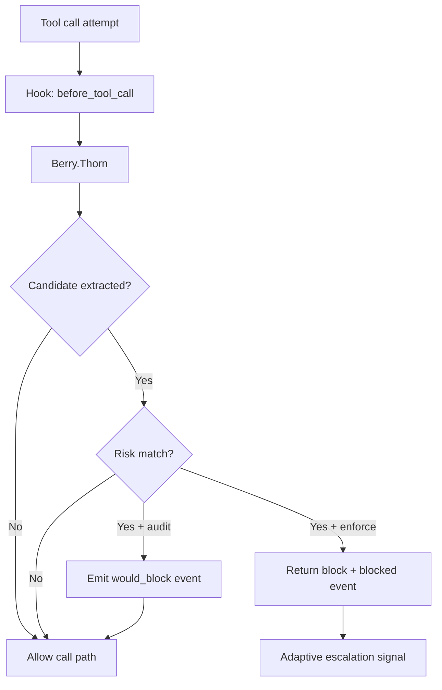

---
summary: "Layer reference for Berry.Thorn (pre-tool-call interception and blocking when hook is available)"
read_when:
  - You need to understand hook-level blocking behavior
  - You are validating runtime interception before tool execution
  - You are debugging blockReason results from tool-call interception
title: "thorn"
---

# `Berry.Thorn`

Berry.Thorn is the **hook-level tool blocker layer**.

It intercepts tool calls before execution and evaluates command/path intent against risk patterns.
When risk is detected, behavior depends on runtime mode.

## What Thorn does

- Hooks into before_tool_call.
- Extracts command candidates from tool params for execution-like calls.
- Extracts file path candidates from tool params for file-like calls.
- Matches candidates against destructive-command and sensitive-file patterns.
- Emits structured audit events in both audit and enforce paths.
- In enforce, can return block response with block reason.
- Signals adaptive escalation on enforce denies.

## What Thorn does not do

- It does not execute tools.
- It does not redact output content.
- It does not replace the gate tool path from Stem.
- It is only effective when before_tool_call is available/invoked in host runtime.

## Runtime flow

## Decision inputs

Thorn consumes:
- tool name
- tool params payload
- optional session key from hook context
- effective destructive and sensitive-file pattern sets
- runtime mode (audit or enforce)

## Decision behavior (high level)

### Destructive command path
- command candidate extracted from known command fields
- if destructive pattern match:
  - audit: record observation and allow path
  - enforce: return block response with security reason

### Sensitive file reference in command path
- command text also checked for sensitive file references
- same audit/enforce split as above

### Sensitive file access path
- file path candidate extracted for file-like tools
- if sensitive path match:
  - audit: record observation and allow path
  - enforce: return block response with security reason

### Adaptive escalation signal
- on enforce block, sends denied signal to policy runtime state
- prefers session-scoped escalation when session key exists
- optional configured global escalation fallback when session key is missing

## How Thorn interacts with other layers

### With Stem
- Thorn is hook-based interception.
- Stem is tool-based security gate.
- They are complementary: Stem covers gate-tool path even if hook coverage varies.

### With Root
- Root guides model behavior to call gate checks early.
- Thorn enforces at interception point when hook fires.

### With Pulp
- Thorn can stop risky execution paths before tool run.
- Pulp sanitizes content on output-side paths.

### With Leaf
- Leaf provides incoming-message observability.
- Thorn provides pre-execution interception signals.

## Operational value

Thorn is useful for:
- hard stop behavior on risky tool calls where host hook is active
- consistent block reason payloads for agent/tool feedback
- capturing pre-execution blocked telemetry for report/audit analysis

## Limits and caveats

- Hook availability/invocation depends on host runtime behavior.
- Candidate extraction relies on known param keys and tool-name heuristics.
- Complex/obfuscated command forms may reduce detection quality.
- Should be operated together with Stem for stronger coverage.

## Validation checklist

1. Trigger file-tool call with sensitive path and confirm mode-specific outcome.
2. Trigger exec-tool call with destructive command and confirm block behavior in enforce.
3. Switch to audit and confirm same inputs emit observation events without hard block.
4. Confirm report reflects expected blocked or observation counts.

## See layers

- [root](root.md)
- [stem](stem.md)
- [pulp](pulp.md)
- [leaf](leaf.md)

## Related pages

- [layers index](README.md)
- [decision modes](../decision/modes.md)
- [decision patterns](../decision/patterns.md)
- [decision posture](../decision/posture.md)

---

## Navigation

- [Back to Layers Index](README.md)
- [Back to Wiki Index](../README.md)
