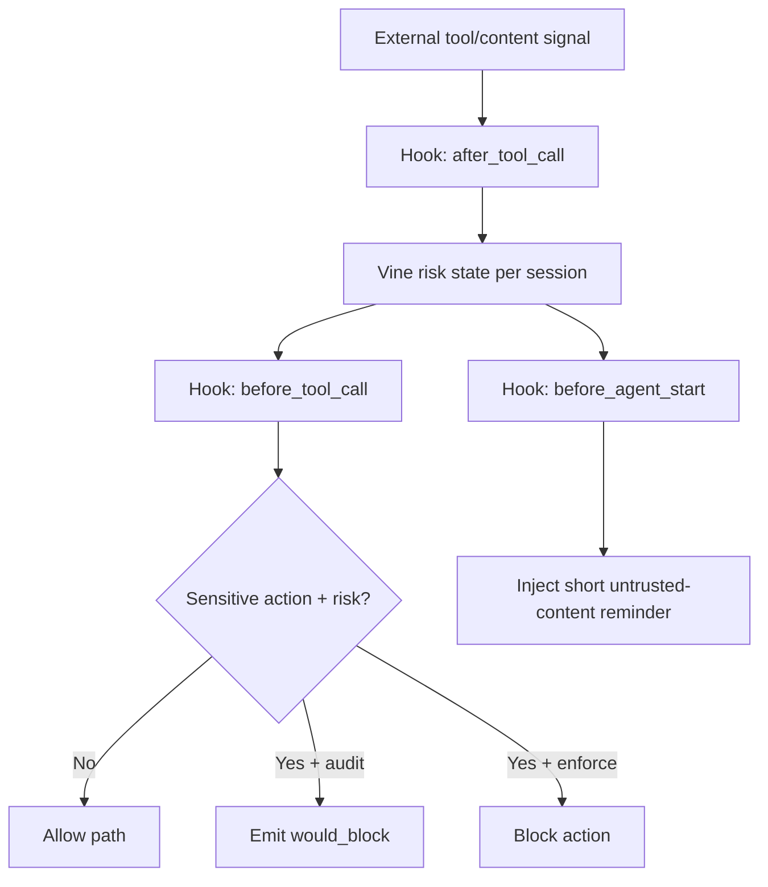

---
summary: "Layer reference for Berry.Vine (external-content trust guard and prompt-injection hardening)"
read_when:
  - You need to understand how Berry handles untrusted external content
  - You are validating external-signal blocking behavior in audit/enforce
  - You are tuning false positives around unknown-origin content
title: "vine"
---

# `Berry.Vine`

Berry.Vine is the **external-content trust guard layer**.

It reduces prompt-injection risk by treating external content as untrusted by default and enforcing trust-aware checks before sensitive operations.

## What Vine does

- Tracks external-risk signals per session.
- Marks risk when external-ingestion tool paths are observed.
- Guards sensitive actions in `before_tool_call` when risk is active.
- Applies different behavior in `audit` and `enforce`.
- Adds a short context reminder in `before_agent_start` only when needed (throttled).
- Clears session state on `session_end`.

## What Vine does not do

- It does not guarantee complete prevention of all prompt-injection techniques.
- It does not replace Stem/Thorn/Pulp controls.
- It does not rely on semantic AI classification.
- It does not auto-remediate without explicit operator action.

## Runtime flow

## Trust labels and policy intent

Vine tracks origin trust labels as runtime signals:
- `trusted_user`
- `external_untrusted`
- `system_internal`
- `unknown`

Key operational rule:
- User-origin message does not automatically mean instruction trust.
- External payload and copied third-party instructions remain untrusted until confirmed by user intent.

## Mode behavior

### Enforce
- Sensitive actions under active external risk can be blocked.
- In strict profile, unknown-origin sensitive attempts can also block.

### Audit
- No hard block.
- Emits `would_block` events for tuning and validation.

## Interaction with other layers

### With Root
- Vine can add short trust reminders at turn start.
- Root still owns global policy injection strategy (full/short/none).

### With Stem and Thorn
- Stem/Thorn remain execution gates.
- Vine adds trust-origin context so risky instructions from external content are less likely to pass.

### With Pulp
- Pulp sanitizes output content.
- Vine focuses on trust of instruction origin before sensitive actions.

## Operational value

Vine is useful for:
- browser/email/webhook-heavy workflows
- reducing "execute what this page says" risk
- introducing trust-aware controls without replacing existing rule engine

## Real-world examples

### Case: external page tells the agent to run a command
- If the page is ingested through an external tool path observed by Vine, session risk is marked.
- A later sensitive write-like or destructive action is guarded.
- In `audit`, Vine records `would_block`.
- In enforce, Vine can block and report a blocked decision event.

### Case: user pastes external text manually
- Vine may classify this as `unknown` instead of `external_untrusted`.
- Behavior depends on Vine mode:
- `balanced`: tends to observe and escalate carefully.
- `strict`: can block unknown-origin sensitive attempts.

### Case: no sensitive action follows
- Vine does not block "just for reading".
- Guarding happens when a sensitive action is attempted.

## Threat-model boundaries

Vine is focused on instruction-origin trust before sensitive actions. It does not replace:
- Pulp for output redaction and leak minimization.
- Stem/Thorn for broader execution gates.
- Host/runtime sandboxing and OS-level isolation.

## Runtime validation principles

Vine validation is a runtime behavior check, not an exploit demonstration.

Use this principle:
- run normal agent/tool workflows that include external-content ingestion;
- let Berry observe and decide during regular execution flow;
- verify evidence in structured outcomes (`would_block` in `audit`, active mitigation decision in `enforce`) through report/log telemetry.

Important scope:
- this validation assumes operator-guided execution in a real OpenClaw runtime;
- the objective is to confirm decision posture and traceability, not to publish bypass or injection recipes.

## Limits and caveats

- Hook timing and availability still depend on host runtime behavior.
- Unknown-origin classification can create false positives if over-tuned.
- Risk decay should not depend only on elapsed time.

## See layers

- [root](root.md)
- [stem](stem.md)
- [thorn](thorn.md)
- [pulp](pulp.md)
- [leaf](leaf.md)

## Related pages

- [layers index](README.md)
- [decision modes](../decision/modes.md)
- [decision patterns](../decision/patterns.md)
- [decision posture](../decision/posture.md)
- [CLI status](../operation/cli/status.md)

---

## Navigation

- [Back to Layers Index](README.md)
- [Back to Wiki Index](../README.md)
